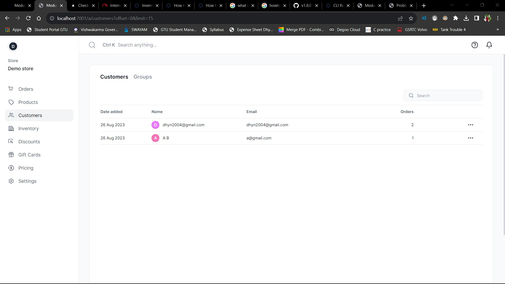
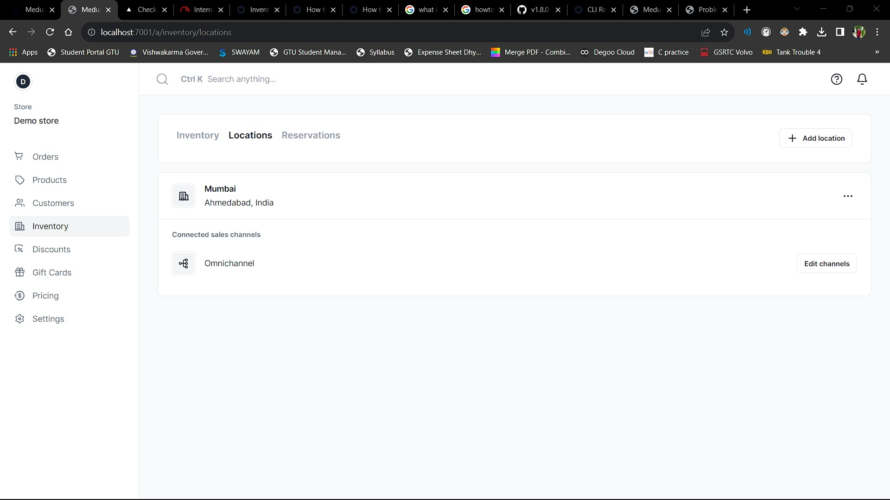
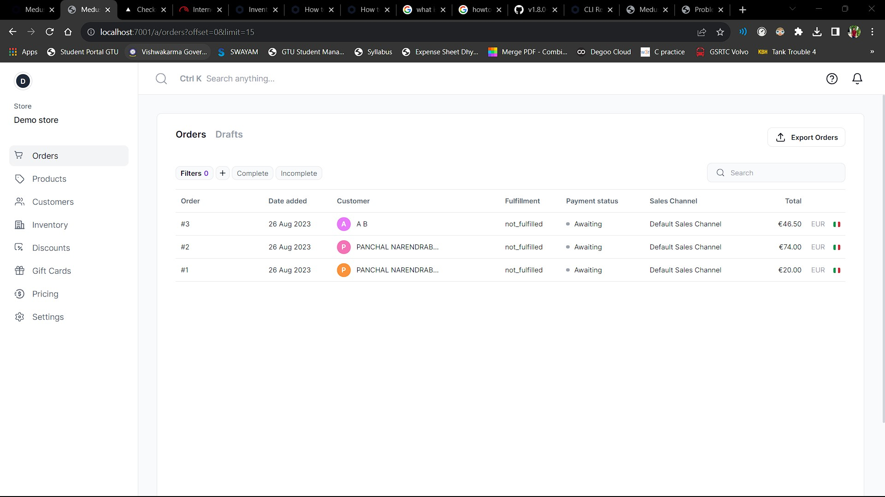
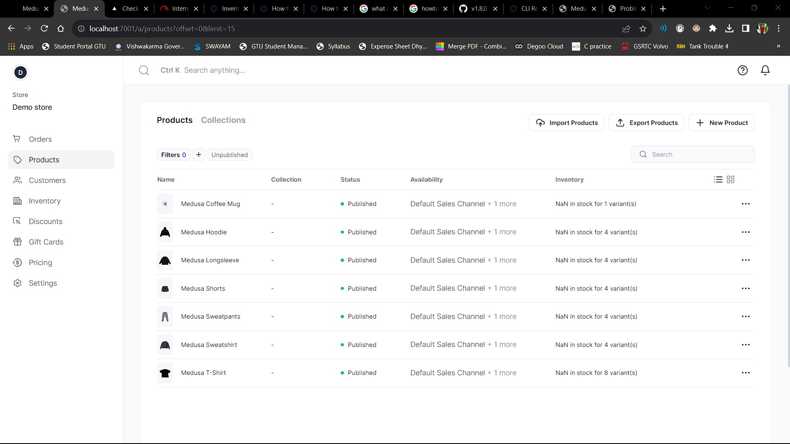

# Project Name: Retail Wave
## Theme: Logistic Tech
## Table of Contents
- [Problem](#problem)
- [Solution](#solution)
- [Benefits](#benefits)
- [Target Audience](#target-audience)
- [Use Cases](#use-cases)
- [Tech Stack](#tech-stack)
- [Product Images](#product-images)

## Problem

In today's retail landscape, consumers engage with businesses through various channels, both online and offline. However, these channels often operate in isolation, leading to fragmented shopping experiences. This can result in customer dissatisfaction, missed sales opportunities, and inefficiencies for retailers and brands.

## Solution

Retail Wave addresses this challenge by providing a seamless and integrated solution for retailers to bridge the gap between their online and offline channels. By unifying the shopping journey, retailers can offer consistent product information, personalized recommendations, and convenient shopping options, regardless of the chosen channel. They can also choose which products are available for offline segments and reserve inventory accordingly, improving inventory management and boosting sales and customer satisfaction.

## Benefits

- *Enhanced Shopping Experience:* Customers enjoy a consistent, user-centric shopping experience whether they shop online, in-store, or through a mobile app.
- *Increased Customer Loyalty:* Unified experiences build trust and loyalty, encouraging customers to return.
- *Optimized Inventory Management:* Retailers gain real-time visibility into stock levels across channels, reducing overstocking and stockouts.
- *Higher Conversion Rates:* Personalized recommendations and smoother transitions between channels lead to higher conversion rates.

## Target Audience

- Retailers of all sizes looking to provide a modern and seamless shopping experience.
- E-commerce businesses seeking to expand their online presence while maintaining physical stores.
- Tech-savvy entrepreneurs interested in launching innovative retail solutions.

## Use Cases

1. *Online-to-Offline (O2O) Conversion:* A customer explores products on a retailer's website and then visits the physical store to try them before purchasing. Their online cart seamlessly transfers to the in-store POS for a convenient checkout process.

2. *Buy Online, Pick Up In-Store (BOPIS):* Shoppers buy products online and collect them in person. The solution ensures items are ready for pickup, streamlining the process for both customers and staff.

3. *Cross-Channel Recommendations:* Customers receive personalized product recommendations based on their online and offline shopping history, encouraging more purchases.

## Tech Stack

- *Next.js:* A React framework for building fast and scalable web applications.
- *Node.js:* A runtime environment for server-side JavaScript execution.
- *PostgreSQL:* An open-source relational database system.
- *Medusa:* A headless commerce front.

## Product Images

### Customer List:

### Inventory & Location-Based Reservation Management:

### Orders:

### Products List:

---